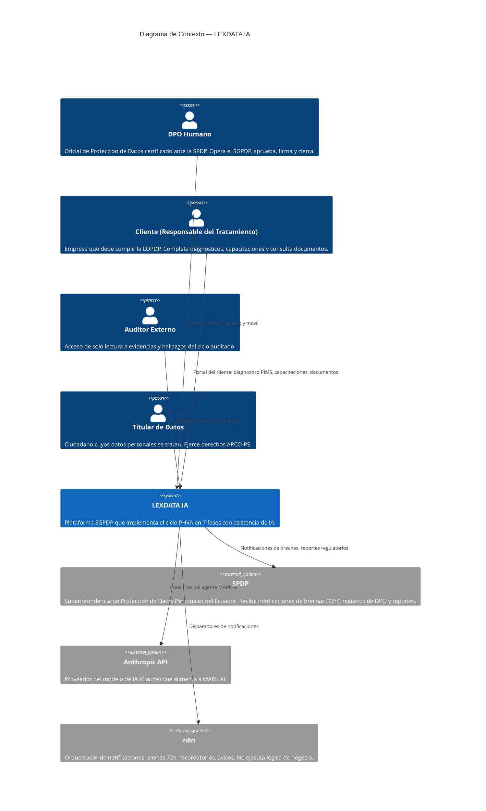
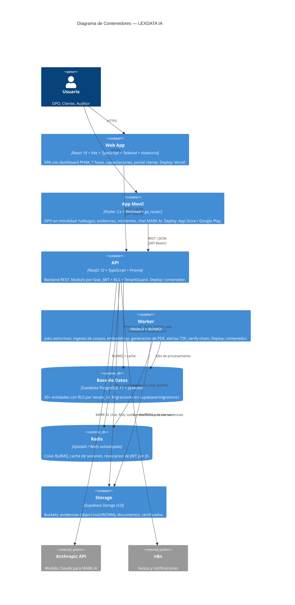
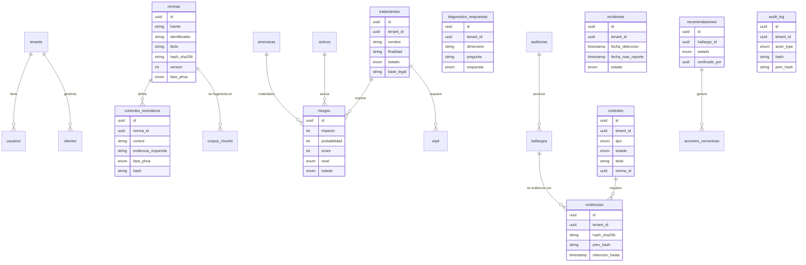
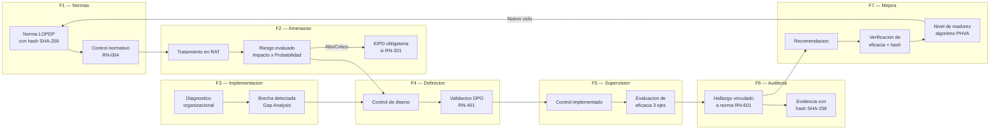
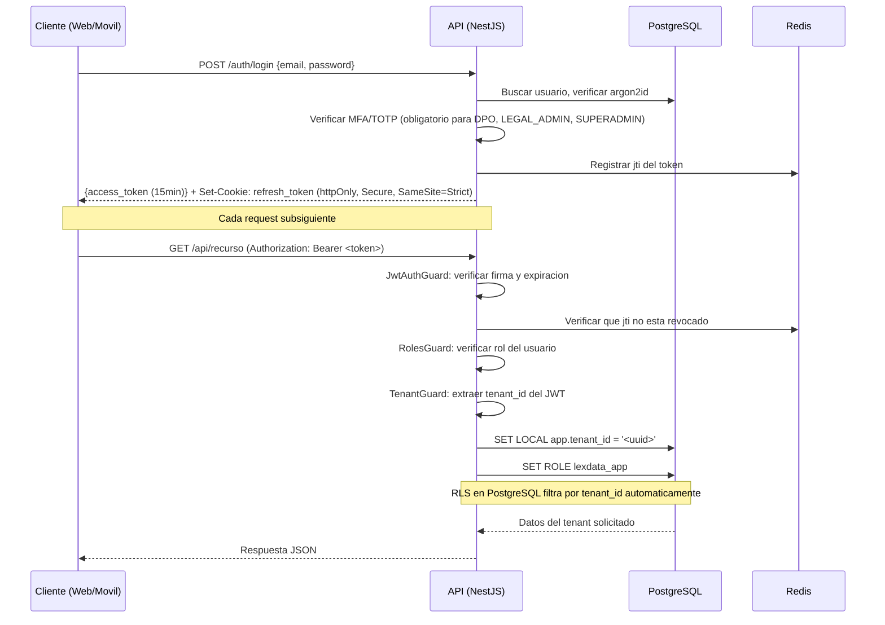
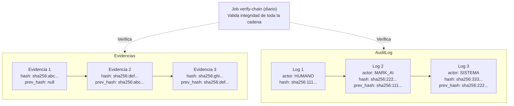
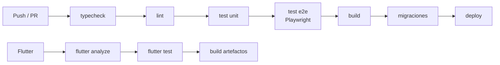

# Arquitectura — LEXDATA IA

Documento de arquitectura tecnica del Sistema de Gestion de Proteccion de Datos Personales (SGPDP) para la LOPDP del Ecuador.

---

## 1. Diagrama de Contexto (C4 — Nivel 1)



---

## 2. Diagrama de Contenedores (C4 — Nivel 2)



---

## 3. Capas del Backend

```
apps/api/src/
├── common/          Guards (JwtAuth, Roles, Tenant), interceptors, filtros,
│                    PrismaService con SET LOCAL app.tenant_id
├── auth/            Login, refresh, MFA TOTP, recuperacion, sesiones
├── tenants/         Tenants, usuarios, invitaciones
├── clientes/        Empresas responsables + motor de riesgo Pd-VaR
├── corpus/          Normas, controles normativos, principios (RN-004)
├── fase2/           Procesos, RAT, activos, categorias, amenazas, riesgos, EIPD/LIA
├── fase3/           Diagnostico, gobierno, roles, recursos, brechas
├── fase4/           Controles de diseno, medidas, validacion de principios, planes
├── fase5/           Controles implementados, eficacia, hallazgos operativos
├── fase6/           Auditorias, revisiones, checklist, hallazgos, incidentes, KPIs
├── fase7/           Recomendaciones, acciones, lecciones, madurez, oportunidades
├── capacitaciones/  Cursos, evaluaciones, certificados
├── portal/          PIMS + formulario SPDP + motor Pd-VaR
├── evidencias/      Boveda SHA-256, storage S3, cadena de integridad
├── documentos/      Generacion documental, aprobacion, firma
├── reportes/        Reporting Engine (PDF institucionales)
├── agente/          MARK AI: chat, RAG, tools, guardrails, cola de firma
└── audit/           audit_log append-only + verify-chain
```

---

## 4. Modelo de datos por dominio



### Entidades por fase

| Fase | Entidades principales |
|------|----------------------|
| F1 — Normas | `normas`, `controles_normativos`, `principios`, `corpus_chunks` |
| F2 — Amenazas | `procesos`, `tratamientos`, `activos`, `categorias_datos`, `amenazas`, `vulnerabilidades`, `riesgos`, `eipd` |
| F3 — Implementacion | `diagnostico_respuestas`, `gobierno_elementos`, `roles_sgpdp`, `recursos`, `brechas` |
| F4 — Definicion | `controles_diseno`, `medidas_tecnicas`, `medidas_organizativas`, `medidas_juridicas`, `planes_accion`, `hallazgos_diseno` |
| F5 — Supervision | `controles_implementados`, `evaluaciones_eficacia`, `hallazgos_operativos` |
| F6 — Auditoria | `auditorias`, `revisiones`, `checklist_respuestas`, `hallazgos`, `incidentes`, `indicadores` |
| F7 — Mejora | `recomendaciones`, `acciones_correctivas`, `lecciones`, `oportunidades`, `madurez` |
| Transversales | `tenants`, `usuarios`, `clientes`, `evidencias`, `documentos`, `audit_log`, `capacitaciones`, `evaluaciones`, `certificados` |

---

## 5. Flujo de trazabilidad F1 a F7



**Principio fundamental:** cada hallazgo tiene "partida de nacimiento" en la norma (F1) y evidencia inalterable con hash (F6). La trazabilidad es completa, auditable y defendible ante la SPDP.

---

## 6. Arquitectura de seguridad

### 6.1 Autenticacion y autorizacion



### 6.2 Row-Level Security (RLS)

```
Principio: Todo acceso a datos de negocio pasa por el rol lexdata_app
con NOBYPASSRLS. El tenant_id se inyecta via SET LOCAL.

                    ┌─────────────────────────┐
                    │      API (NestJS)        │
                    │                          │
                    │  TenantGuard extrae      │
                    │  tenant_id del JWT       │
                    │         │                │
                    │  PrismaService ejecuta:  │
                    │  SET LOCAL app.tenant_id │
                    │  SET ROLE lexdata_app    │
                    └────────┬────────────────┘
                             │
                    ┌────────▼────────────────┐
                    │    PostgreSQL + RLS      │
                    │                          │
                    │  Politica por tabla:     │
                    │  WHERE tenant_id =       │
                    │  current_setting(        │
                    │    'app.tenant_id')      │
                    │                          │
                    │  Roles:                  │
                    │  - anon: sin acceso      │
                    │  - authenticated: sin    │
                    │    acceso a tablas de    │
                    │    negocio               │
                    │  - lexdata_app: acceso   │
                    │    filtrado por RLS      │
                    │  - postgres: solo en     │
                    │    SystemDbService       │
                    └─────────────────────────┘
```

### 6.3 Cadena de integridad



### 6.4 Resumen de decisiones de seguridad

| Aspecto | Decision |
|---------|----------|
| Contrasenas | `argon2id`, minimo 12 caracteres |
| MFA | TOTP obligatorio para `DPO_HUMANO`, `LEGAL_ADMIN`, `SUPERADMIN` |
| JWT | Access token 15 min, refresh rotativo en cookie `httpOnly+Secure+SameSite=Strict` |
| Revocacion | Por `jti` en Redis |
| Cifrado en transito | TLS 1.3 |
| Cifrado en reposo | Disco/volumenes cifrados; columnas PII con `pgcrypto` |
| Storage | Object-lock/WORM, versionado, URLs prefirmadas de corta vida |
| Rate limiting | Global + especifico en login, chat del agente, generacion de PDF |
| Cabeceras | Helmet, CSP estricta, sin `unsafe-inline` |
| Logs | Sin datos personales. Redaccion de PII en el logger |
| Retencion | `retencion_hasta` en evidencias (5 anos) |
| Secretos | Solo por variables de entorno. Prohibido `.env` en git |

---

## 7. Entornos y despliegue

| Entorno | Web | API + Worker | Base de datos | Notas |
|---------|-----|-------------|---------------|-------|
| `local` | `localhost:5173` | `localhost:3001` | docker-compose (postgres+pgvector, redis, minio, mailhog) | `pnpm dev` |
| `staging` | Vercel preview | Contenedor staging | Supabase branch | Datos ficticios, identico a produccion |
| `produccion` | Vercel | Contenedores (Railway/Fly/VPS) | Supabase gestionado (backups PITR) | Storage con object-lock, CDN |

### Pipeline de CI/CD



---

## 8. Observabilidad

- **Logs:** Pino (estructurados) con `request_id` y `tenant_id`. Sin PII.
- **Metricas:** Prometheus (latencia, tamano de colas, tokens del agente, PDFs generados).
- **Errores:** Sentry en web, API y Flutter.
- **Alertas operativas:**
  - Incidente a menos de 24 h de su plazo de 72 h.
  - Ruptura de cadena de hash.
  - Fallo de ingesta del corpus.
  - Cola de firmas pendiente > 48 h.

---

## 9. Reporting Engine

El motor de reportes genera PDFs institucionales con validez para presentar ante la SPDP.

- **Motor:** React + `@react-pdf/renderer` (simples) + Playwright/Chromium HTML-to-PDF (complejos con graficos).
- **Ejecucion:** En el `worker`, no en el proceso HTTP.
- **Plantillas:** Estado General SGPDP, Informe de Auditoria, Hallazgos e Incidentes, Dashboard de Indicadores, Reporte PHVA y Riesgos, Informe de Implementacion (F3), Reporte Ejecutivo de Riesgos (F2), Reporte de Alineacion (F4), informes de capacitaciones (3), certificados individuales.
- **Todos los PDF incluyen:** encabezado institucional, empresa, periodo, DPO responsable, hash SHA-256 y codigo de verificacion.
